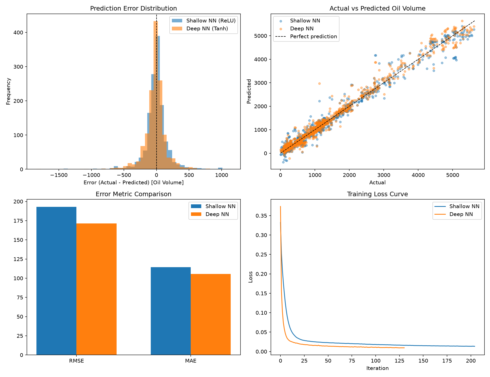

# Well Production NN Comparison

Predicting daily oil production volume (`BORE_OIL_VOL`) from downhole and
wellhead sensor readings using two neural network architectures, and
comparing their prediction accuracy.

## Overview

Oil wells continuously log sensor data — downhole pressure, temperature,
tubing pressure differential, choke size, wellhead pressure/temperature —
that can be used to predict production output without running full
reservoir simulations. This project trains two multi-layer perceptron
(MLP) neural networks with different depths and activation functions on
real well production data, then compares their error distributions.

| Model | Architecture | Activation |
|---|---|---|
| Shallow NN | 1 hidden layer (32 units) | ReLU |
| Deep NN | 3 hidden layers (64 → 32 → 16 units) | Tanh |

## Dataset

`Well_production_analysis_data.csv` — daily production records from 7
wells, including:

- `ON_STREAM_HRS`, `AVG_DOWNHOLE_PRESSURE`, `AVG_DOWNHOLE_TEMPERATURE`
- `AVG_DP_TUBING`, `AVG_ANNULUS_PRESS`, `AVG_CHOKE_SIZE_P`
- `AVG_WHP_P`, `AVG_WHT_P`, `DP_CHOKE_SIZE`
- Target: `BORE_OIL_VOL`

Rows are filtered to producing wells (`FLOW_KIND == "production"`) that
were actively flowing (`ON_STREAM_HRS > 0`), with missing/invalid values
removed. ~6,900 rows remain after cleaning.

## Results

| Model | RMSE | MAE | R² |
|---|---|---|---|
| Shallow NN (ReLU) | 193.06 | 114.41 | 0.977 |
| Deep NN (Tanh) | 171.45 | 105.53 | 0.982 |

The deeper network achieves lower error and a tighter, more consistent
error distribution, though both models fit the data well.



The figure includes:
1. Prediction error histograms for both models
2. Actual vs. predicted scatter plot
3. RMSE/MAE bar chart comparison
4. Training loss curves

## Usage

```bash
pip install pandas numpy matplotlib scikit-learn
python nn_compare.py
```

Update the CSV path in `nn_compare.py` if running outside the original
environment.

## Files

- `nn_compare.py` — data cleaning, model training, evaluation, and plotting
- `Well_production_analysis_data.csv` — source dataset
- `nn_comparison.png` — output comparison figure

## Notes

- Built with scikit-learn's `MLPRegressor` (backpropagation-trained NN).
  A TensorFlow/Keras version can be substituted with minimal changes if
  those libraries are available.
- Features are standardized (`StandardScaler`) before training, which is
  essential for neural network convergence.
